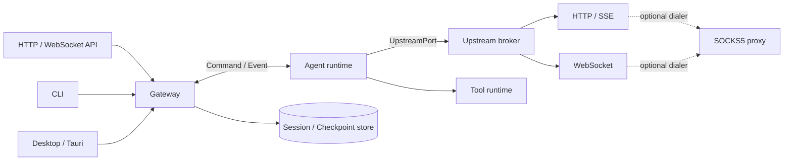
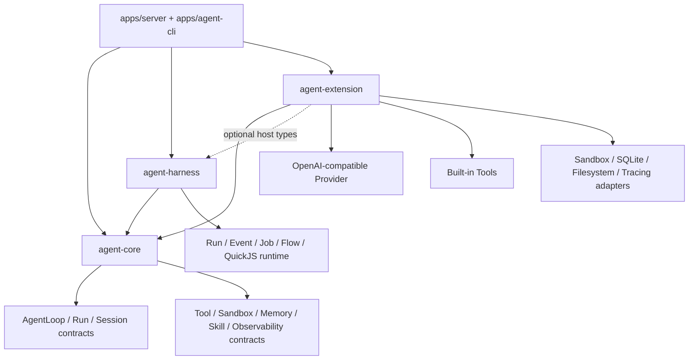

# Mina 架构与边界划分

> 状态：初始架构建议。本文定义模块职责、依赖方向和推荐的 Rust workspace 结构；消息细节见 [Gateway–Agent 协议](./02-gateway-agent-protocol.md)，上游连接细节见 [Gateway–上游协议](./03-gateway-upstream-protocol.md)。

当前仓库没有一次性创建下述所有 crate，而是先按同样的依赖方向落地最小纵向切片。已实现结构见 [单次任务运行时](./04-single-task-runtime.md)。

## 1. 设计结论

Mina 建议先实现为**模块化单体**，而不是一开始就拆成多个服务：HTTP 服务、CLI 和桌面端共享同一个 `GatewayApi`；Gateway 通过稳定的命令/事件协议驱动 Agent；Agent 只负责推理与执行状态机；模型服务、远端代理等上游能力通过 `UpstreamPort` 注入。

第一版可以全部在同一进程中运行，但边界上不传框架对象和内部结构体。将来需要隔离或横向扩展时，只替换协议的承载方式，不改业务语义。



这里的 Gateway 是应用门面和运行时宿主，不是 Agent 的一部分。Gateway 负责装配 upstream，所以从部署视角可以称为“Gateway 连接上游”；从代码依赖看，Agent 只依赖 `UpstreamPort`，不依赖具体 HTTP、WS 或 SOCKS 实现。

## 2. 四条边界

### 2.1 接入边界：HTTP、CLI、桌面端 → Gateway

三种入口只负责输入输出适配：

- HTTP/WS：鉴权、限流、请求解码、状态码和流式响应映射；
- CLI：参数解析、终端渲染、退出码和 Ctrl-C 取消；
- Desktop：Tauri command/event、窗口生命周期、本机权限提示；
- 统一调用 `GatewayApi`，不得直接创建 Agent、调用模型或访问 Agent 状态库。

外部 API DTO 与内部领域类型要分开。比如 HTTP 的 `camelCase`、CLI 的路径参数、桌面端的文件句柄都应在入口处转换，不能向内泄漏 `axum`、`clap` 或 `tauri` 类型。

### 2.2 应用边界：Gateway → Agent

Gateway 负责“谁可以发起什么运行”，Agent 负责“这次运行具体如何推进”。

Gateway 的职责：

- 用户/租户身份、权限、配额与限流；
- 对外 session ID 与内部 agent session 的映射；
- 创建、恢复、取消、排队和并发策略；
- 将 Agent 事件持久化、投影并转发给 HTTP/CLI/Desktop；
- 管理运行时、配置、密钥、上游和工具实现；
- 审计、指标、trace 和统一错误映射。

Gateway 不应该：

- 拼接系统提示词或决定下一步调用哪个工具；
- 修改 Agent 的上下文压缩、记忆或推理规则；
- 根据文本片段猜测 Agent 是否结束。

Agent 的职责：

- session/run 状态机；
- 上下文构建、模型调用循环、工具调用编排；
- token/上下文预算、checkpoint 和恢复语义；
- 产出结构化事件、终止原因和可恢复错误；
- 请求需要宿主完成的副作用或人工审批。

Agent 不应该知道用户通过 HTTP、CLI 还是桌面端进入，也不应该持有用户鉴权信息或上游密钥。

### 2.3 能力边界：Agent → Upstream / Tool / Store

Agent 通过窄接口使用外部能力：

- `UpstreamPort`：标准化的模型/远端服务请求及流式事件；
- `ToolPort`：工具发现、调用、取消和结果；
- `CheckpointPort`：保存和加载可恢复状态；
- `Clock`、`IdGenerator`：让重放和测试可控。

端口由运行时注入。Agent 不能直接依赖 `reqwest`、WebSocket 客户端、SOCKS 库、数据库驱动或桌面 API。

### 2.4 基础设施边界：语义协议 → 具体承载

协议先定义稳定语义，再选择承载：

- 同进程：有界 `tokio::mpsc` channel；
- 本机跨进程：Unix Domain Socket（Windows 使用 Named Pipe）；
- 跨机器：HTTP/2 双向流或 WebSocket，并强制 TLS；
- SOCKS5：只作为 `Dialer` 帮 HTTP/WS 建连，不承担 Mina 业务语义。

## 3. 当前目标 workspace

```text
mina/
├── Cargo.toml
├── apps/
│   ├── server/                   # HTTP/SSE composition root
│   ├── agent-cli/                # CLI composition root
│   └── web/                      # Next.js 调试工作台
├── crates/
│   ├── core/                     # agent-core：契约与 Agent 决策逻辑
│   ├── harness/                  # agent-harness：宿主运行时、耐久编排、QuickJS
│   └── extension/                # agent-extension：外部 Provider/Tool/Store/Sandbox/监控
└── docs/
```

细粒度 crate 已收敛为 `core + harness + extension` 三个产品级包。QuickJS 属于 Harness 的可选脚本运行能力；Core 只保留脚本契约。脚本能访问的文件、网络、工具和事件仍必须通过显式 Capability port 注入。

## 4. 依赖方向



必须遵守：

1. `agent-core` 不依赖 `agent-harness`、`agent-extension`、Web 框架、数据库驱动、QuickJS 或 Provider SDK。
2. `agent-harness` 依赖 Core 契约，不依赖 Extension 的具体 adapter。
3. `agent-extension` 只能实现 Core/Harness 定义的端口，不得重新定义运行状态和公共事件。
4. `apps/server` 与 `apps/agent-cli` 是 composition root，负责选择并装配具体实现。
5. transport/provider adapter 可以依赖 Core 端口，Core 端口不能反向依赖 adapter。

可在 CI 用 `cargo deny`、workspace dependency 约束或简单的依赖图检查守住这些规则。

## 5. 核心对象与所有权

| 对象 | 权威所有者 | 说明 |
|---|---|---|
| `PublicSession` | Gateway | 用户可见标题、权限、租户、展示状态 |
| `AgentSession` | Agent | 上下文、记忆、run 状态、checkpoint revision |
| `Run` | Agent | 一次输入触发的完整执行；每个 run 有唯一 `run_id` |
| `EventLog` | Gateway | 按 session/run 持久化 Agent 事件，供断线续传和审计 |
| `Checkpoint` | Agent 定义，Store 保存 | Agent 决定内容与兼容版本，存储层只负责可靠保存 |
| `UpstreamCredential` | Gateway runtime | 不进入 Agent 状态、事件或日志 |
| `Approval` | Gateway | Agent 发请求，Gateway 根据策略或用户决定后返回结果 |

第一版建议每个 session 最多一个 active run，不同 session 可并行。这能让取消、事件顺序和 checkpoint 语义保持清晰；确有需求时再增加 session 内并行分支。

## 6. 对外统一门面

Gateway 对三种接入端暴露相同语义，Rust 接口可以类似：

```rust
pub trait GatewayApi: Send + Sync {
    async fn create_session(&self, req: CreateSession) -> Result<SessionView, GatewayError>;
    async fn submit(&self, req: SubmitInput) -> Result<RunAccepted, GatewayError>;
    async fn cancel(&self, session_id: SessionId, run_id: RunId) -> Result<(), GatewayError>;
    async fn approve(&self, req: ApprovalDecision) -> Result<(), GatewayError>;
    async fn subscribe(
        &self,
        session_id: SessionId,
        after_seq: Option<u64>,
    ) -> Result<EventStream, GatewayError>;
}
```

这只是应用端口，不是 wire schema。入口适配器负责身份上下文、deadline、客户端断开和 DTO 转换。

## 7. 生命周期与数据流

一次典型运行：

1. 接入端把用户身份和输入转换为 `SubmitInput`。
2. Gateway 校验权限、配额、幂等键和 session revision，创建 `run_id`。
3. Gateway 向 Agent 发送 `StartRun`，并订阅该 run 的事件。
4. Agent 调用注入的 upstream/tool 端口；需要审批时暂停状态机并发事件。
5. Gateway 先可靠保存事件，再向在线客户端广播；客户端可用 event sequence 续传。
6. Agent 发出唯一的终态事件，Gateway 更新投影并释放运行配额。
7. CLI/桌面端退出或 HTTP 断开不等同于取消；只有显式 cancel 或策略超时才取消 run。

## 8. 错误与取消边界

跨边界错误必须是稳定、可匹配的错误码，而不是 Rust 错误字符串。至少区分：

- `invalid_argument`、`unauthenticated`、`permission_denied`；
- `not_found`、`conflict`、`resource_exhausted`；
- `upstream_unavailable`、`deadline_exceeded`；
- `agent_failed`、`internal`。

错误对象包含 `code`、安全的 `message`、`retryable`、可选 `retry_after_ms` 和 `details`；底层 error chain 只进入已脱敏的内部日志。

取消用结构化 token 从入口一路传播到 Agent、工具和 upstream。所有长期任务还必须有 deadline，不能仅依赖客户端连接生命周期。

## 9. 安全边界

- 密钥只存在于 Gateway runtime/upstream adapter，不序列化到协议、checkpoint 或 trace；
- 工具声明副作用等级：`read_only`、`write_local`、`external_side_effect`；
- 高风险工具由 Gateway 的策略引擎审批，Agent 不可自行绕过；
- 文件能力传 opaque handle 或受限路径，不把桌面端任意路径直接当可信输入；
- 上游目标使用 allowlist、防 DNS rebinding 和连接超时，SOCKS 代理配置单独保护；
- 所有事件日志均按租户隔离，并定义 retention 和删除策略。

## 10. 测试边界

- Agent：用 fake `UpstreamPort`/`ToolPort` 做确定性状态机测试和 checkpoint 重放测试；
- Gateway：用 fake agent endpoint 测权限、幂等、事件投影、取消和断线续传；
- Protocol：golden fixture、未知字段、版本兼容、重复和乱序测试；
- Upstream：provider 合同测试；HTTP/SSE、WS 和 SOCKS dialer 分层测试；
- 端到端：同一组行为用 HTTP、CLI、Desktop 三个入口验证，终态应一致。

## 11. 建议的实施顺序

1. 建 workspace、`kernel`、`agent-protocol`、`upstream-api`，先固定 ID、错误码和事件模型。
2. 用同进程有界 channel 接通 `gateway` 与一个最小 `agent`。
3. 实现 HTTP/SSE upstream adapter 和 fake adapter，完成 run/cancel/checkpoint。
4. 接 HTTP API、CLI；桌面端复用同一 `GatewayApi`。
5. 加事件持久化、断线续传、审批和 WS upstream。
6. 最后按真实部署需求增加跨进程承载与 SOCKS5 dialer，不提前引入分布式复杂度。
