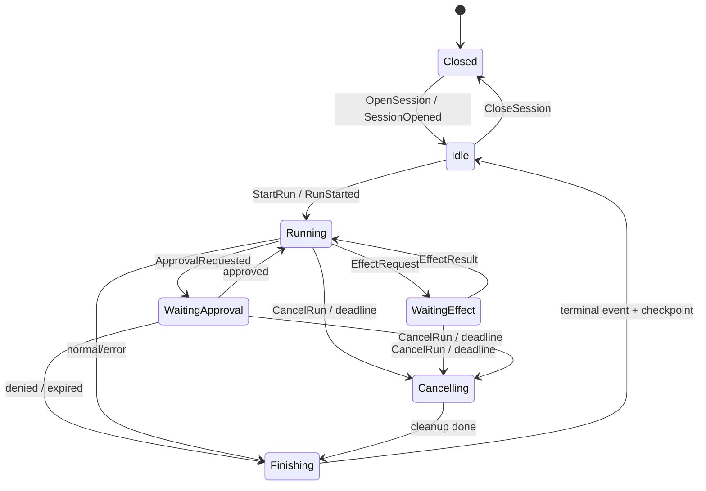

# Gateway–Agent 交互协议

> 状态：协议设计草案。本文定义 Gateway 与 Agent 的语义契约；具体是同进程 channel、Unix Domain Socket 还是网络流，不改变这里的消息含义。

## 1. 目标与选择

推荐采用**双向、异步、命令/事件式协议**：Gateway 发送命令，Agent 发送事件；Agent 需要宿主执行模型调用、工具、审批或持久化时，使用带关联 ID 的 effect request/result。

不要设计成一个持续很久的 `run(prompt) -> String` RPC。Agent 会流式输出、等待审批、调用工具、被取消或在断线后恢复，单请求/单响应无法准确表达这些状态。

协议需要满足：

- 一个连接复用多个 session/run；
- 流式事件有序、可去重、可续传；
- 命令幂等，取消具有竞态下的明确语义；
- 协议版本和能力可协商；
- 同进程与跨进程具有相同的行为；
- 未知字段和未知事件可被旧版本安全忽略或拒绝。

## 2. 角色与信任模型

- Gateway 是宿主：鉴权、配额、密钥、持久化、审批策略和对外事件流的权威方。
- Agent 是状态机：上下文、推理循环、工具编排、checkpoint 内容和 run 终态的权威方。
- 一条 Agent endpoint 可以承载多个 session；每个 session 第一版只允许一个 active run。
- Gateway 断线不代表 run 自动取消。Agent 应运行到 deadline，或在 host lease 过期后按协商策略暂停/取消。

## 3. 传输与编码

推荐顺序：

1. **第一版同进程**：`tokio::mpsc` 有界队列，直接传协议 DTO；
2. **本机隔离**：长度前缀 frame + Unix Domain Socket / Named Pipe；
3. **远端部署**：HTTP/2 双向流或 WebSocket + TLS/mTLS。

跨进程 wire schema 建议使用 Protobuf，`prost` 生成 Rust 类型。理由是字段编号和未知字段规则比直接序列化 Rust enum 更适合长期演进。JSON 只作为调试表示，不作为存储格式或正式兼容契约。

所有跨进程 frame 必须设置大小上限；大附件先写 blob store，协议中只传 `BlobRef`，禁止把任意大文件塞入消息帧。

## 4. 公共信封

概念结构如下；最终以 `.proto` 为准：

```text
Envelope {
  protocol_version: "1.0"
  message_id: UUIDv7
  connection_id: UUID
  session_id: UUID
  run_id?: UUID
  correlation_id?: UUID
  seq?: u64
  sent_at_ms: u64
  traceparent?: string
  payload: oneof { Control, Command, Event, EffectRequest, EffectResult }
}
```

字段语义：

| 字段 | 规则 |
|---|---|
| `message_id` | 每条消息唯一，用于诊断和短期去重 |
| `session_id` | Gateway 分配的内部 session ID；握手消息可为空 |
| `run_id` | run 相关消息必填；session 级消息为空 |
| `correlation_id` | result/response 指向对应 command/effect 的 `message_id` |
| `seq` | Agent 事件的 session 单调序号，由 Agent 分配；命令不使用 |
| `sent_at_ms` | 仅供观测，不用于排序和正确性判断 |
| `traceparent` | W3C Trace Context；不得携带凭据或用户内容 |

业务顺序以 `seq`/revision 为准，不能依赖机器时钟。

## 5. 握手与能力协商

连接建立后，第一对消息必须是：

```text
Gateway -> Agent: Hello {
  supported_versions: ["1.0"]
  gateway_instance_id
  max_frame_bytes
  heartbeat_interval_ms
  requested_capabilities
}

Agent -> Gateway: HelloAck {
  selected_version: "1.0"
  agent_instance_id
  max_frame_bytes
  capabilities: {
    checkpoint_version
    effect_kinds
    max_concurrent_sessions
    event_replay
  }
}
```

没有共同 major version 时立即关闭连接并返回 `incompatible_protocol`。minor version 只允许新增可选字段或新能力；改变既有字段含义必须升 major。

## 6. Gateway → Agent 命令

建议的第一版命令：

| 命令 | 核心字段 | 语义 |
|---|---|---|
| `OpenSession` | `session_id`, `agent_config`, `resume_from?` | 创建或从 checkpoint 恢复 Agent session |
| `StartRun` | `run_id`, `input`, `expected_revision`, `deadline_ms`, `idempotency_key` | 在空闲 session 上开始一次运行 |
| `CancelRun` | `run_id`, `reason` | 请求协作式取消；可重复发送 |
| `ApprovalResult` | `approval_id`, `decision`, `constraints?` | 回应 Agent 的审批请求 |
| `EffectResult` | `effect_id`, `result/error` | 回应模型、工具、存储等宿主 effect |
| `CloseSession` | `mode: checkpoint_then_close | abort` | 释放 Agent session |
| `AckEvents` | `through_seq` | 表示 Gateway 已可靠保存到该序号 |

`StartRun.input` 使用 tagged union，例如 `TextInput`、`StructuredInput`、`BlobRefInput`，不要只留一段无法扩展的字符串。

每个修改 session 状态的命令携带 `expected_revision`。不匹配时返回 `revision_conflict`，防止两个 Gateway 实例或客户端覆盖状态。

## 7. Agent → Gateway 事件

事件是已发生事实，使用过去式命名。建议至少包括：

| 事件 | 关键内容 | 是否可丢弃 |
|---|---|---|
| `SessionOpened` | `revision`, `resumed`, `capabilities` | 否 |
| `RunStarted` | `run_id`, `revision` | 否 |
| `OutputDeltaProduced` | `stream_id`, `channel`, `bytes/text` | 可合并，不可静默丢失 |
| `OutputCompleted` | `stream_id`, `content_ref/hash` | 否 |
| `ToolCallRequested` | `call_id`, `name`, `arguments`, `effect_level` | 否 |
| `ApprovalRequested` | `approval_id`, `summary`, `risk`, `expires_at` | 否 |
| `CheckpointCreated` | `checkpoint_ref`, `checkpoint_version`, `revision` | 否 |
| `UsageUpdated` | token、费用或时间增量 | 可合并 |
| `RunCompleted` | `finish_reason`, `final_revision`, `result_ref?` | 否 |
| `RunFailed` | 稳定错误对象、`final_revision` | 否 |
| `RunCancelled` | `cancelled_by`, `final_revision` | 否 |

每个 run 必须且只能有一个终态事件：`RunCompleted`、`RunFailed` 或 `RunCancelled`。

`OutputDeltaProduced.channel` 应是稳定枚举，例如 `assistant_text`、`reasoning_summary`、`tool_status`。不要把模型供应商私有事件直接暴露给 Gateway。内部 chain-of-thought 不进入协议；如产品需要，只传明确允许展示的摘要。

## 8. Effect：Agent 请求宿主能力

当密钥、网络或高风险能力由 Gateway runtime 持有时，Agent 发送 effect：

```text
EffectRequest {
  effect_id
  kind: ModelInvoke | ToolInvoke | SaveCheckpoint
  deadline_ms
  idempotency_key
  body
}

EffectResult {
  effect_id
  chunk_seq?
  body: Accepted | Delta | Completed | Failed
}
```

流式 effect（如模型响应）使用同一个 `effect_id` 和连续 `chunk_seq`。`Completed`/`Failed` 二选一结束 effect。

同进程实现也应走 `UpstreamPort`/`ToolPort`，不要求真的编码成 Protobuf；跨进程 Agent 才将端口调用映射为 effect 消息。这样不会为第一版增加不必要的序列化开销，同时保留隔离能力。

审批不要伪装成工具失败：Agent 先发 `ApprovalRequested` 并进入 `WaitingApproval`，Gateway 返回 `ApprovalResult` 后再继续或有序终止。

## 9. Session/run 状态机



规则：

- `StartRun` 只允许在 `Idle`；否则返回 `session_busy`；
- cancel 是请求，不是立即宣告成功；收到 `RunCancelled` 才表示结束；
- 若完成与取消竞态，Agent 发出的第一个终态事件为准，Gateway 必须接受合法的 `RunCompleted`；
- 终态前应清理子任务，并使未完成 effect 失效；迟到结果按 `effect_id` 丢弃并记录指标；
- checkpoint 应包含 schema version；恢复失败必须显式返回，不可静默创建空 session。

## 10. 顺序、确认与恢复

- `seq` 在一个 session 内严格递增，包含所有不可丢事件；
- Gateway 按序可靠保存后发送 `AckEvents { through_seq }`；
- Agent 至少保留未确认事件到内存或本地 spool，超出上限时施加背压；
- 重连时 Gateway 提供 `last_acked_seq`，Agent 从下一条重放；
- Gateway 以 `(session_id, seq)` 建唯一索引，重复事件写入应是 no-op；
- 如果 Agent 不具备 `event_replay` 能力，跨进程断连时 run 进入 `recovery_required`，不可假装继续成功。

第一版同进程可以由 Gateway 的 event store 实现可靠保存，但序号和 ACK 语义仍建议保留，避免以后改协议。

## 11. 幂等与一致性

- `OpenSession`：同一 `session_id` + 相同配置重复执行返回已有 session；配置冲突报错；
- `StartRun`：以 `(session_id, idempotency_key)` 去重，返回同一 `run_id`；
- `CancelRun`：天然幂等，终态后重复取消返回当前终态；
- `ApprovalResult`：同一 `approval_id` 只能做一次决定，相同决定可重放，不同决定报冲突；
- `EffectResult`：以 `(effect_id, chunk_seq)` 去重。

exactly-once 网络投递不可假设；协议目标是 at-least-once delivery + 幂等消费。

## 12. 背压与资源上限

- 命令、事件和 effect 使用独立的有界队列，避免大量文本 delta 阻塞取消/审批；
- 控制消息优先，但不能永久饿死数据消息；
- 可以把相邻文本 delta 合并，终态、审批和工具调用不得丢弃；
- 协商 `max_frame_bytes`、每 session 未确认字节数、并发 effect 数和最大附件数；
- 达到上限时先暂停读取 upstream；无法恢复时以 `resource_exhausted` 有序终止；
- Gateway 向慢客户端广播时使用自己的缓冲/落盘续传，不能反向无限拖住 Agent。

## 13. 错误模型

```text
ProtocolError {
  code: stable_enum
  message: safe_human_message
  retryable: bool
  retry_after_ms?: u64
  details?: map<string, scalar>
}
```

错误分为：

- 命令拒绝：状态机继续存在，如 `session_busy`、`revision_conflict`；
- run 失败：必须伴随 `RunFailed`；
- 连接/协议失败：如坏 frame、无共同版本，关闭 endpoint 并触发恢复；
- effect 失败：先返回 effect error，由 Agent 决定重试、降级还是结束 run。

`message` 不能包含 token、密钥、完整提示词、工具敏感输出或内部 backtrace。

## 14. 最小 Protobuf 轮廓

```proto
message Envelope {
  string protocol_version = 1;
  bytes message_id = 2;
  bytes session_id = 3;
  optional bytes run_id = 4;
  optional bytes correlation_id = 5;
  optional uint64 seq = 6;
  oneof payload {
    Control control = 10;
    Command command = 11;
    Event event = 12;
    EffectRequest effect_request = 13;
    EffectResult effect_result = 14;
  }
}
```

落地时要保留删除字段的编号，enum 必须有 `UNSPECIFIED = 0`，不要改变已有编号的含义。

## 15. 验收用协议场景

上线前至少覆盖以下序列测试：

1. 正常流式运行并产生唯一终态；
2. `StartRun` 重复投递不创建第二个 run；
3. 输出中途 cancel，迟到 upstream chunk 被忽略；
4. 等待审批时断线、重连、事件重放并继续；
5. Gateway 保存事件后崩溃，按 `last_acked_seq` 去重恢复；
6. revision 冲突被拒绝且 Agent 状态不变；
7. 慢客户端不会造成 Agent 队列无限增长；
8. 新 minor 版本事件被旧端安全处理；
9. checkpoint 版本不兼容时显式失败；
10. 无共同 major 版本时握手失败且没有执行业务命令。
