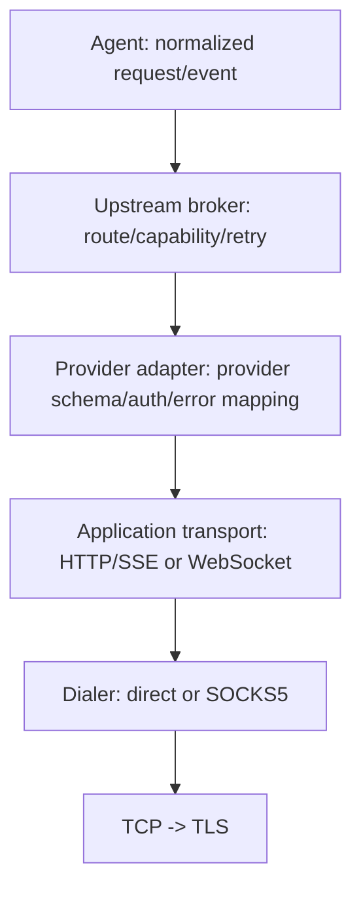

# Gateway–上游协议与 HTTP/WS/SOCKS 分层

> 状态：协议设计草案。本文中的“上游”指模型服务、远端 Agent 服务或其他由 Mina 主动调用的服务。如果产品中的“上游”特指调用 Mina 的客户端，则客户端仍应使用 Gateway 的公开 HTTP/WS API，不应使用本协议或 SOCKS。

## 1. 核心判断

HTTP、WebSocket 和 SOCKS 不在同一抽象层：

- HTTP/SSE 是请求/响应与服务端流式传输；
- WebSocket 是全双工消息通道；
- SOCKS5 只负责把 TCP/UDP 连接代理到目标地址，不定义业务消息。

因此应统一的是**上游业务语义**，而不是三种网络协议本身。推荐分成四层：



这样同一个 OpenAI-compatible HTTP adapter 既能直连，也能经 SOCKS5；WebSocket adapter 同理。SOCKS 配置不进入 Agent，也不改变业务事件。

选择标准：

| 方式 | 在架构中的角色 | 何时使用 | 默认建议 |
|---|---|---|---|
| HTTP + JSON | 单次请求/响应 | 非流式、状态查询、取消接口 | 推荐 |
| HTTP + SSE | 单向流式响应 | 模型输出、服务端事件 | 第一版首选 |
| WebSocket | 全双工且可多路复用 | 高频交互、连接内取消、事件续传 | 有明确需求再用 |
| SOCKS5 | TCP/UDP 代理拨号 | 网络出口、隐私或企业代理 | 作为 HTTP/WS 下层可选项 |

## 2. 上游端口

`mina-upstream-api` 暴露稳定的规范化端口：

```rust
pub trait UpstreamPort: Send + Sync {
    async fn capabilities(
        &self,
        target: &UpstreamTarget,
    ) -> Result<Capabilities, UpstreamError>;

    async fn execute(
        &self,
        request: UpstreamRequest,
        context: RequestContext,
    ) -> Result<UpstreamEventStream, UpstreamError>;
}
```

`RequestContext` 包含 deadline、cancel token、trace、租户路由标签和预算，但不把 HTTP header map 暴露给 Agent。

规范化请求建议包含：

```text
UpstreamRequest {
  request_id
  target { provider, deployment, model }
  conversation[] { role, content_parts[] }
  tools[] { name, description, input_schema, effect_level }
  tool_choice
  response_format
  sampling { temperature?, top_p?, seed? }
  limits { max_output_tokens?, max_cost?, deadline_ms }
  idempotency_key
  metadata             # 白名单键值，不传任意 header
}
```

`content_parts` 使用 tagged union：`Text`、`ImageRef`、`AudioRef`、`DocumentRef`、`ToolCall`、`ToolResult`。二进制数据使用受权限控制的引用或按 provider 要求在 adapter 层加载，不在领域层到处复制 base64。

## 3. 规范化响应事件

所有 provider/transport 映射到同一事件流：

| 事件 | 说明 |
|---|---|
| `Accepted` | 上游确认请求，含可选 provider request ID |
| `ContentDelta` | 可展示文本/多模态内容增量 |
| `ToolCallDelta` | 工具参数的流式片段，仅供组装 |
| `ToolCallCompleted` | 已校验的完整工具名和参数 |
| `Usage` | input/output/cache token、费用等累计或增量 |
| `RateLimitObserved` | 额度和 reset 信息，供路由器使用 |
| `Completed` | 唯一成功终态，含规范化 finish reason |
| `Failed` | 唯一失败终态，含稳定错误对象 |

finish reason 统一为 `stop`、`length`、`tool_call`、`content_filter`、`cancelled`、`error`、`unknown`。provider 原始原因可放在仅供日志的脱敏字段，不能让 Agent 依赖某家字符串。

事件流必须恰好一个终态。HTTP status、SSE 的 `[DONE]`、WS close frame 都只是 adapter 的输入信号，不直接当领域终态。

## 4. Broker、Provider、Transport、Dialer 的边界

### 4.1 Upstream broker

负责：

- 根据模型、能力、租户策略选择 provider/deployment；
- 熔断、并发限制、速率限制和健康状态；
- 预算校验、可观测性和稳定错误分类；
- 在满足幂等规则时重试或 failover；
- 返回规范化事件。

不负责 provider JSON、HTTP header、WS frame 或 SOCKS 握手。

### 4.2 Provider adapter

负责：

- 规范化 request 与供应商 schema 互转；
- 注入凭据和供应商必需 header；
- 解析 SSE/WS 消息，组装工具参数；
- 映射 usage、finish reason、错误和 rate-limit header；
- 声明真实 capability，不能静默丢掉不支持的参数。

### 4.3 Application transport

负责 HTTP/SSE 或 WebSocket 的连接、frame、超时和协议级背压。它只处理 bytes/message，不理解“模型”“工具”或“Agent”。

### 4.4 Dialer

```rust
pub trait Dialer: Send + Sync {
    async fn connect(&self, target: HostPort, ctx: DialContext)
        -> Result<BoxedIo, ConnectError>;
}
```

实现包括 `DirectDialer` 和 `Socks5Dialer`。TLS 应在 SOCKS 建立 TCP tunnel 后，由 Mina 对最终目标主机完成握手和证书校验；不能信任代理替代目标 TLS。

## 5. HTTP/SSE 承载

当上游支持标准请求/响应或 server streaming 时优先 HTTP：实现简单、代理兼容好、每个请求隔离清晰。

逻辑交互建议：

```text
POST /v1/requests
Authorization: Bearer <adapter injects secret>
Idempotency-Key: <request idempotency key>
Traceparent: <trace context>
Accept: text/event-stream

-> 2xx + JSON response
or
-> 2xx + SSE stream: accepted, delta*, usage*, completed|failed
```

如果上游由 Mina 团队控制，建议补充：

- `GET /v1/capabilities`：版本、模型、streaming、tools、resume 能力；
- `GET /v1/requests/{request_id}`：断线后查询状态；
- `DELETE /v1/requests/{request_id}`：显式取消；
- `Last-Event-ID`：上游支持时用于 SSE 续传；
- `Idempotency-Key`：创建请求去重。

HTTP 规则：

- 连接超时、首字节超时、帧间 idle timeout 和总 deadline 分开配置；
- 响应体设置字节上限，SSE 单事件设置大小上限；
- 非 2xx body 也必须限长后再解析；
- 客户端断开应传播 cancel，但不能假设丢 TCP 就一定取消了远端请求；
- 若上游不支持状态查询/取消，应将能力显式标记为 false。

## 6. WebSocket 承载

当需要频繁双向消息、一个连接复用多个请求、实时取消或服务端主动事件时使用 WebSocket。

连接握手后先协商：

```text
C -> S: hello {
  versions: ["1.0"],
  auth,
  capabilities: ["multiplex", "resume", "credit_flow"]
}
S -> C: hello_ack {
  version: "1.0",
  connection_id,
  capabilities,
  heartbeat_ms,
  max_message_bytes
}
```

后续 frame 均携带 `request_id`：

```text
C -> S: start { request_id, idempotency_key, request }
C -> S: cancel { request_id, reason }
C -> S: ack { request_id, through_seq }
C -> S: credit { request_id, events_or_bytes }

S -> C: accepted { request_id }
S -> C: event { request_id, seq, event }
S -> C: failed { request_id, seq, error }
```

WebSocket 规则：

- `request_id` 用于多路复用，`seq` 在单 request 内递增；
- 连接级 ping/pong 仅检测活性，不替代业务 ACK；
- 支持 resume 时，重连发送每个 request 的 `last_acked_seq`；
- 不支持 resume 时，断线中的请求标为结果未知，按幂等/查询能力决定是否重试；
- 使用 credit 或有界队列控制流量，禁止无界缓存；
- auth 放握手 header 或一次性 hello credential，后续 frame 不重复携带密钥；
- WS close code 映射为 transport error，只有收到业务终态才算请求完成。

如果上游只处理单个请求且只向客户端流式输出，HTTP/SSE 通常比 WebSocket 更合适。

## 7. SOCKS5 的正确位置

SOCKS5 典型组合：

```text
Mina -> SOCKS5 CONNECT target.example:443
     -> TLS(target.example)
     -> HTTP/1.1, HTTP/2 or WebSocket
     -> provider application protocol
```

需要明确配置 DNS 行为：

- `remote_dns = true`：把域名交给 SOCKS 代理解析，可避免本地 DNS 泄漏；
- `remote_dns = false`：本地解析后传 IP，便于本地策略控制，但会暴露 DNS 查询。

安全要求：

- 代理地址、认证方式和允许的目标均由 Gateway runtime 管理；
- 禁止用户输入直接决定任意内网地址，需防 SSRF、环回/链路本地/云 metadata 访问；
- 对解析结果和实际连接目标都做策略校验，防 DNS rebinding；
- SOCKS 用户名/密码不写日志，不进入 Agent 事件；
- 即使 SOCKS 已认证，也必须验证最终目标的 TLS 证书和主机名。

如果确实需要在 SOCKS tunnel 内跑 Mina 自定义协议，也应在 tunnel 建立后使用“长度前缀 + 版本握手 + 业务 frame”；这仍是内层协议，不是 SOCKS 协议本身。除非两端都由 Mina 控制，否则不建议新造协议。

## 8. Capability 协商

路由前先得到结构化 capability：

```text
Capabilities {
  models[]
  streaming
  bidirectional
  tools
  parallel_tool_calls
  multimodal_inputs[]
  structured_output
  idempotency
  cancel
  status_query
  event_resume
  max_context_tokens?
  max_output_tokens?
}
```

Agent 提交的是需求而不是猜测。若需求超出能力，broker 返回 `unsupported_capability`，不能静默删除工具、response format 或附件。

能力可来自静态配置、启动探测或上游 endpoint，并带 TTL；运行中的一次请求使用固定快照，避免中途语义变化。

## 9. 重试、failover 与幂等

重试策略按阶段决定：

| 阶段 | 默认策略 |
|---|---|
| 尚未成功建连 | 可对可重试网络错误指数退避 + jitter |
| 请求未被上游接受，且有幂等键 | 可重试 |
| 已接受但尚无输出 | 仅当上游支持幂等/状态查询时重试 |
| 已向 Agent 交付任何内容 delta | 默认禁止透明重试，防止重复或拼接不同答案 |
| 收到明确 rate limit | 尊重 `retry_after`，并受总 deadline 限制 |
| 鉴权、参数、内容策略错误 | 不重试 |

failover 到另一个 provider 可能改变模型行为，只能在无可见输出且策略允许时发生，并产生可观测的 route-attempt 记录。不要在 Agent 不知情的情况下把两个部分响应拼成一次结果。

## 10. 错误分类

规范化 `UpstreamError` 至少包含：

```text
kind:
  invalid_request | authentication | permission_denied |
  unsupported_capability | rate_limited | overloaded |
  connect_timeout | response_timeout | connection_lost |
  protocol_violation | content_filtered | cancelled | internal
retryable: bool
retry_after_ms?: u64
provider_request_id?: string
safe_message: string
```

HTTP 状态、WS close code、SOCKS reply code 先由相应 adapter 转成 transport/provider error，再规范化。完整原始 body 不能直接回传或写普通日志。

## 11. 取消和 deadline

- Gateway 给每次 upstream 请求一个绝对 deadline 和 cancellation token；
- broker 的排队、重试、建连、TLS、首包和流式读取共享总 deadline；
- HTTP：停止读 body，同时在支持时调用显式 cancel endpoint；
- WS：发送 `cancel`，等待短暂确认后释放本地状态；
- SOCKS：关闭已建立 tunnel；SOCKS 本身不提供业务取消；
- cancel 后迟到事件按 `request_id` 丢弃，但记录计数；
- deadline/cancel 是正常终态，不能被包装成模糊的 `internal`。

## 12. 观测与隐私

每次请求至少记录：`request_id`、`run_id`、provider/deployment、transport、是否经代理、attempt、延迟、usage、规范化终态和错误 kind。

默认不记录：Authorization、Cookie、SOCKS 凭据、完整 prompt、完整输出、工具参数、附件内容。调试采样必须显式开启、按租户授权、限制保留时间并支持删除。

建议拆分延迟：queue、DNS、proxy connect、TCP、TLS、request write、TTFT、stream duration；否则出现慢请求时无法判断是代理、网络还是 provider。

## 13. 配置模型

把 provider、transport 和 dialer 分开配置，避免组合爆炸：

```toml
[upstreams.primary]
provider = "openai_compatible"
transport = "primary_http"
model = "example-model"
credential_ref = "secret://upstream/primary"

[transports.primary_http]
kind = "http_sse"
base_url = "https://api.example.com"
dialer = "corp_proxy"
connect_timeout_ms = 5000
idle_timeout_ms = 30000

[dialers.corp_proxy]
kind = "socks5"
address = "127.0.0.1:1080"
remote_dns = true
credential_ref = "secret://proxy/corp"
```

配置加载后先做静态校验，再构建不可变 runtime snapshot；运行中的请求不要观察到半更新配置。

## 14. 建议实现顺序

1. 定义 `UpstreamRequest`、`UpstreamEvent`、`Capabilities`、`UpstreamError` 和 fake adapter；
2. 完成一个 HTTP/SSE provider adapter，覆盖取消、超时、错误映射和响应上限；
3. 增加 broker 的限流、路由、幂等和安全重试；
4. 有明确双向/复用需求后实现 WebSocket；
5. 将网络建连抽成 `Dialer`，实现 SOCKS5 并复用现有 HTTP/WS adapter；
6. 用合同测试保证直连与 SOCKS 下的业务事件完全一致。

## 15. 验收场景

1. 同一请求经 direct 和 SOCKS5 得到相同的规范化事件序列；
2. HTTP/SSE 在半条事件、超大事件、无 `[DONE]` 时正确失败；
3. WS 断线时按 capability 选择 resume、查询或结果未知，不盲目重放；
4. cancel 能停止本地消费，并在上游支持时发出远端取消；
5. 已输出 delta 后的网络错误不发生透明 failover；
6. 不支持 tools/structured output 时在调用前拒绝；
7. SOCKS remote DNS 配置按预期工作，且 TLS 验证最终目标；
8. 私网/metadata 目标被策略拦截，日志不包含任何凭据；
9. rate limit、鉴权、超时和协议错误映射为稳定分类；
10. 慢上游和慢消费者均不会造成无界内存增长。
