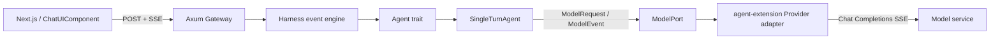
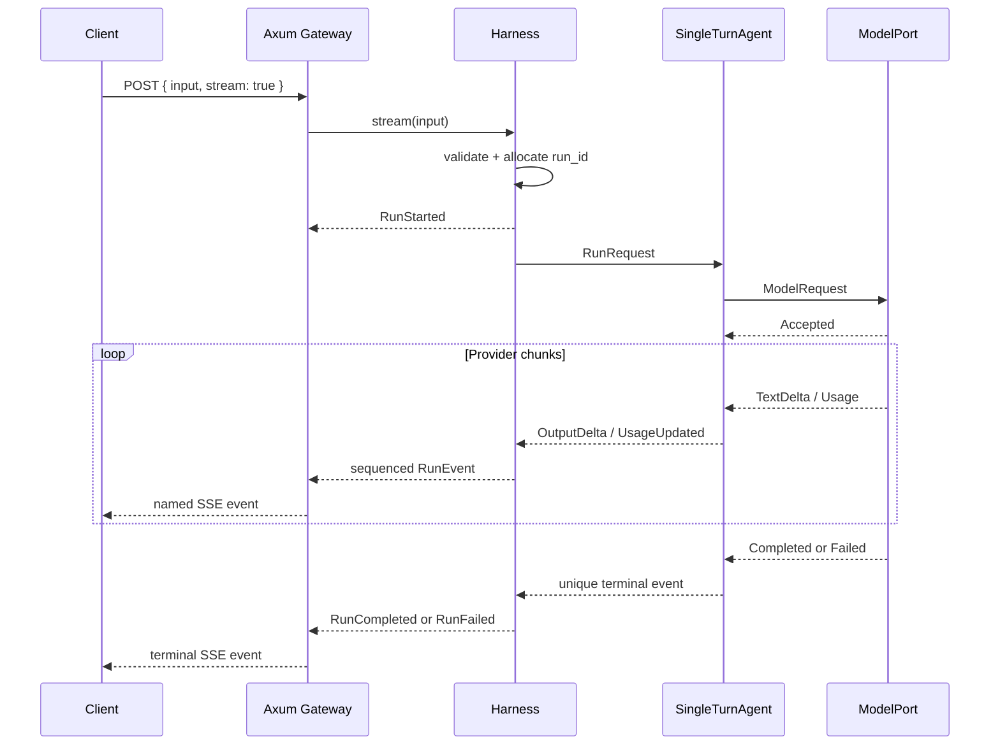

# Mina Agent Framework：单次任务与流式事件引擎

> 状态：MVP 已实现。本文描述当前可运行的纵向切片，以及事件边界如何支持后续工具调用、审批、会话与恢复。

## 1. 单次任务的边界

一次 `POST /api/v1/runs` 是一个独立 run：输入是一段用户目标，Harness 为它生成唯一 `run_id`，Agent 调用模型一次，并以事件流输出结果。当前不读取上一轮历史，也不创建长期 session。

MVP 的硬边界是：

- 一个 run 只调用模型一次；
- 没有工具调用、审批、记忆或 checkpoint；
- 流式 API 是主执行路径，非流式 JSON API 通过聚合同一事件流实现；
- Agent 不知道 HTTP、SSE、API key、provider JSON 或 Next.js；
- provider adapter 不决定系统提示词或 Agent 的执行策略；
- 每个事件流必须且只能产生一个终态。

## 2. 当前架构与依赖方向



依赖方向只有向内：

```text
apps/server ──> agent-core <── agent-extension
```

`apps/server` 是 composition root，负责根据 TOML 选择 Agent、解析密钥、装配实现，并将通用 `RunEvent` 映射为 HTTP/SSE。`agent-core` 不依赖 Axum 或 `reqwest`；`agent-extension::provider` 不依赖 Axum，也不会把上游 JSON 暴露给 Agent。

## 3. 事件属于 Agent 框架

事件引擎位于 `agent-core::harness`，而不是 Gateway。不同层只处理自己拥有的语义：

| 层 | 输入/输出 | 负责什么 | 不负责什么 |
|---|---|---|---|
| Provider adapter | `ModelRequest` → `ModelEvent` | 上游鉴权、SSE 解析、错误和 usage 归一化 | Agent 状态、HTTP 客户端协议 |
| Agent | `RunRequest` → `AgentEvent` | 执行策略，将模型事件解释为任务事件 | `run_id` 分配、序号、SSE 编码 |
| Harness | `AgentEvent` → `RunEvent` | 校验输入、分配 `run_id`、添加 `seq`、保证唯一终态 | Web/CLI/桌面展示方式 |
| Gateway | `RunEvent` → SSE/JSON | HTTP 协商、事件序列化、keep-alive、状态码 | 修改 Agent 语义 |
| Web | SSE → `ChatEvent` | 将增量渲染到 ChatUIComponent | 理解 provider chunk |

当前事件链路是：

```text
OpenAI SSE chunk
  → ModelEvent
  → AgentEvent
  → RunEvent
  → Axum SSE
  → ChatUIComponent text-delta
```

这样 CLI、桌面端和未来的持久化层都可以直接消费 `RunEvent`，不需要解析 Web 专用事件或 OpenAI 私有字段。

## 4. 三层事件协议

### 4.1 ModelEvent：模型能力边界

`ModelPort::stream(ModelRequest)` 返回 pull-based `ModelEventStream`：

```text
Accepted { provider_request_id? }
ReasoningDelta { delta }
TextDelta { delta }
Usage { usage }
Completed { finish_reason }
Failed { error }
```

adapter 必须以一个 `Completed` 或 `Failed` 结束。`ModelError` 只包含稳定错误类别、安全信息和 `retryable`，原始上游响应与凭据不跨越 adapter 边界。

### 4.2 AgentEvent：执行策略边界

`Agent::run(RunRequest)` 返回 `AgentEventStream`：

```text
OutputDelta { channel, delta }
UsageUpdated { usage }
ToolCall* / ToolExecution*
Cancelled
Completed { finish_reason }
Failed { code, message, retryable }
```

当前包含 `assistant_reasoning` 和 `assistant_text` 两个输出通道，以及结构化工具调用、用户审批、执行结果和取消事件。thinking、最终回答、审批与工具状态不会混在一起。

### 4.3 RunEvent：对宿主稳定的公共协议

Harness 给每个事件添加相同的 `run_id` 和从 1 开始连续递增的 `seq`，并自动产生 `run_started`。当前公共事件为：

| `type` | 数据 | 含义 |
|---|---|---|
| `run_started` | 无 | Harness 已接受并开始该 run |
| `output_delta` | `channel`, `delta` | 可追加的思考或最终回答片段 |
| `usage_updated` | `usage` | 当前 token 用量快照 |
| `tool_call_*` | `call_id` 等 | 流式工具调用请求 |
| `approval_*` | `approval_id`, `call_id` 等 | 风险工具审批状态 |
| `tool_execution_*` | `call_id` 等 | 工具执行状态和结果 |
| `run_cancelled` | 无 | 取消终态 |
| `run_completed` | `finish_reason` | 成功终态 |
| `run_failed` | `code`, `message`, `retryable` | 失败终态 |

核心不变量：

1. 第一个事件一定是 `run_started`，且 `seq = 1`；
2. 同一流内的 `run_id` 不变，`seq` 严格连续递增；
3. `run_cancelled`、`run_completed` 和 `run_failed` 必须且只能出现一个；
4. 终态之后的 Agent 事件不会再向外发送；
5. Agent 未发送终态就结束时，Harness 自动产生不可重试的 `agent_protocol_violation`；
6. 新增非终态事件时，旧客户端可以忽略，但必须继续识别唯一终态。

## 5. SSE API

请求流式结果：

```http
POST /api/v1/runs
Accept: text/event-stream
Content-Type: application/json

{"input":"解释这个项目","stream":true}
```

响应示例：

```text
event: run_started
data: {"run_id":"b4ae…","seq":1,"type":"run_started"}

event: output_delta
data: {"run_id":"b4ae…","seq":2,"type":"output_delta","channel":"assistant_reasoning","delta":"先分析需求…"}

event: output_delta
data: {"run_id":"b4ae…","seq":3,"type":"output_delta","channel":"assistant_text","delta":"这个项目…"}

event: usage_updated
data: {"run_id":"b4ae…","seq":4,"type":"usage_updated","usage":{"input_tokens":18,"output_tokens":42,"total_tokens":60}}

event: run_completed
data: {"run_id":"b4ae…","seq":5,"type":"run_completed","finish_reason":"stop"}
```

Gateway 每 15 秒发送 SSE keep-alive，并设置 `Cache-Control: no-cache, no-transform` 与 `X-Accel-Buffering: no`，防止常见反向代理缓冲事件。`event` 字段与 JSON 中的 `type` 保持一致；前者方便标准 SSE 客户端分派，后者让日志、队列和非 SSE transport 仍能独立解释事件。

当 `stream` 省略或为 `false` 时，Gateway 调用 `Harness::execute` 聚合同一条事件流并返回兼容 JSON：

```json
{
  "run_id": "b4ae…",
  "output": "这个项目…",
  "finish_reason": "stop",
  "usage": {
    "input_tokens": 18,
    "output_tokens": 42,
    "total_tokens": 60
  }
}
```

因此流式与非流式不会形成两套 Agent 实现，也不会出现行为漂移。

显式取消活动流：

```http
POST /api/v1/runs/{run_id}/cancel
```

存在的活动 run 返回 `202 Accepted`；非法 ID 返回 `400`，已经结束或不存在的 run 返回 `404`。取消令牌会同时传播到 Harness、Agent、当前模型调用和工具调用，事件流最终只产生一个 `run_cancelled`。客户端直接断开 SSE 时，Gateway 也会取消并清理对应的活动 run。

## 6. 单次任务执行序列



流是按需轮询的，天然形成背压。客户端断开后，Axum response 被丢弃，活动 run guard 传播取消并释放底层模型响应流。当前尚未实现跨进程取消确认或断线续传。

## 7. OpenAI-compatible adapter

adapter 使用流式 Chat Completions：

```text
POST {base_url}/chat/completions
Authorization: Bearer {api_key}
Content-Type: application/json

stream = true
stream_options.include_usage = true
```

adapter 将内部 `ModelRequest` 映射为 `model`、`messages`、`max_tokens`，从 `choices[].delta.reasoning_content`（也兼容 `reasoning`）产生思考增量，从 `choices[].delta.content` 产生最终文本增量，从 `finish_reason` 产生标准终止原因，并从最后的 usage chunk 产生 token 用量。

标准服务以 `[DONE]` 结束；部分兼容服务会在含 `finish_reason` 的 chunk 后直接断开，adapter 也接受这种形式。若流在已产生文本后中断，错误标记为不可自动重试，避免重放造成重复输出；若尚未产生文本，则可标记为可重试。当前只暴露能力边界，尚未在 Agent 内实现自动重试策略。

选择 Chat Completions 是为了覆盖更多兼容服务。以后可以增加 Responses 或其他 provider adapter，但它们仍需映射为同一 `ModelEvent`，不能把私有协议泄漏到 `ModelPort`。

协议依据：[OpenAI Chat Completions Streaming Events](https://developers.openai.com/api/reference/resources/chat/subresources/completions/streaming-events)。

## 8. 配置和运行模式

真实单次任务：

```toml
[agent]
kind = "single-turn"
system_prompt = "You are Mina, a helpful agent."

[models.primary]
model = "gpt-4.1"
max_output_tokens = 4096

[models.primary.provider]
type = "openai-compatible"
base_url = "https://api.openai.com/v1/"
api_key = "replace-with-real-key"
```

不调用上游的本地开发：

```toml
[agent]
kind = "echo"
```

两种模式都使用 `/api/v1/runs` 和相同事件协议，所以前端无需分支。

## 9. 下一阶段

建议沿现有事件边界迭代：

单次 run 的状态投影、SQLite 事件持久化、断线续传和重启终结语义已经实现，详见 [单次 Run 状态与持久化](./08-single-run-state-storage.md)。下一阶段为：

1. **Session**：增加 `session_id` 和消息历史，同一 session 第一版只允许一个 active run；
2. **Checkpoint resume**：将等待审批或异步事件的执行点保存为可序列化 checkpoint，而不保存 Future；
3. **隔离部署**：只有出现崩溃隔离或独立扩缩容需求时，才把 Harness–Agent 端口换成 UDS/Protobuf 或双向网络流。

工具能力加入后，run 状态可演进为：

```text
Accepted -> Running -> WaitingModel
                    -> WaitingTool
                    -> WaitingApproval
                    -> Completed | Failed | Cancelled
```

无论增加多少中间状态，`run_id`、连续 `seq`、唯一终态和 provider-neutral 事件这四个约束都应保持不变。
